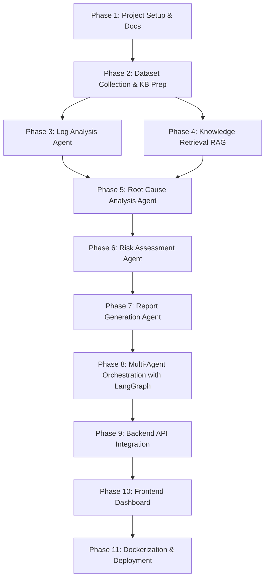

# Autonomous Incident Response System (AIRS)

AIRS is an enterprise-grade, multi-agent AI and Retrieval-Augmented Generation (RAG) platform designed to automate incident investigation, root cause analysis, and remediation planning within complex IT and security operations environments.

By integrating LLM reasoning, specialized agent tasks, and retrieval from local knowledge sources (vector databases & search indexes), AIRS transforms raw alerts into structured, actionable incident reports, significantly reducing Mean Time to Resolution (MTTR).

---

## 🛠️ Repository Architecture

This repository is structured as a polyglot monorepo to organize the frontend, backend, agentic AI service, and documentation assets in a single version-controlled repository:

```text
AutoSOC/
├── .github/                   # CI/CD pipelines & project issue templates
├── ai-service/                # Python-based Agentic AI & RAG service (LangGraph, ChromaDB, ES)
├── backend-service/           # Java Spring Boot backend service
├── frontend-service/          # React + Tailwind CSS dashboard UI
├── docs/                      # Central system architecture, playbooks, templates, and ADRs
├── datasets/                  # Mock/sandbox logs, alerts, reports, and knowledge documents
├── docker/                    # Docker Compose development and orchestration files
└── README.md                  # Project root documentation
```

---

## 🚀 Technology Stack

| Component | Technology | Role |
| :--- | :--- | :--- |
| **Frontend** | React, Tailwind CSS, Vite | Real-time Operations Dashboard, Interactive Agent Logs, Runbook Viewers |
| **Backend** | Java Spring Boot, Maven | Core API orchestration, Authentication, Postgres storage, Log streaming |
| **AI Layer** | Python 3.11+, LangGraph, Gemini API | Multi-agent collaboration graph, Planner & Specialist LLM chains |
| **Knowledge Layer** | ChromaDB (Vector), Elasticsearch (Lexical) | Hybrid-search vector indexing of internal runbooks & operational data |
| **Containers** | Docker, Docker Compose | Local development setups & orchestration containers |

---

## 📅 Development Roadmap



### Phase Details

* **Phase 1: Project Setup & Documentation**
  * Establish monorepo workspace, setup issue templates, compile standard templates, write initial Architecture Decision Records (ADRs).
* **Phase 2: Dataset Collection & Knowledge Base Preparation**
  * Gather representative sandbox logs (JSON, Syslog, Audit), alerts (Prometheus, CloudWatch), runbooks, and historical incident templates.
* **Phase 3: Log Analysis Agent**
  * Build the log parsing, anomaly detection logic, and suspicious pattern extraction scripts using Python.
* **Phase 4: Knowledge Retrieval (RAG)**
  * Implement document ingestors, chunking, and embedding generation into ChromaDB; configure Elasticsearch for lexical indexation.
* **Phase 5: Root Cause Analysis Agent**
  * Formulate deep diagnostic reasoning patterns to correlate log anomalies against operational runbooks.
* **Phase 6: Risk Assessment Agent**
  * Define severity metrics, calculate system blast radius, confidence metrics, and map incidents against NIST or MITRE attack categories.
* **Phase 7: Report Generation Agent**
  * Assemble root cause outputs and risk metrics into standard markdown post-mortem reports.
* **Phase 8: Multi-Agent Orchestration with LangGraph**
  * Build the primary state graph, nodes, and conditional routers that sequence the execution flow.
* **Phase 9: Backend API Integration**
  * Implement Spring Boot REST APIs for triggering investigations, querying incident records, and fetching reports.
* **Phase 10: Frontend Dashboard**
  * Build high-fidelity client screens to visualize graphs, active agent transitions, and system health status.
* **Phase 11: Dockerization & Deployment**
  * Package microservices as Docker containers, configure service networking, and optimize multi-service orchestration.

---

## ⚙️ Quick Start for Developers

1. **Prerequisites**: Ensure you have Python 3.11+, Java 21, Node.js 20+, and Docker installed on your system.
2. **Setup Subprojects**:
   * Navigate to [ai-service/](file:///c:/Users/priya/OneDrive/Desktop/AutoSOC/ai-service/) for Python environment configuration.
   * Navigate to [backend-service/](file:///c:/Users/priya/OneDrive/Desktop/AutoSOC/backend-service/) for Maven setup.
   * Navigate to [frontend-service/](file:///c:/Users/priya/OneDrive/Desktop/AutoSOC/frontend-service/) for NPM package installs.
3. **Architecture Reference**: Study the central systems architecture guides in [docs/architecture/](file:///c:/Users/priya/OneDrive/Desktop/AutoSOC/docs/architecture/).

---

## Backend Service Setup

### Project Overview
The backend service is a Spring Boot 3.x application scaffolded for the AIRS platform. It is intentionally limited to infrastructure setup, configuration, and cross-cutting concerns so teammates can add modules such as logging and incident management without conflicting with the foundational structure.

### Backend Folder Structure
```text
backend-service/
├── src/main/java/com/airs/backendservice/
│   ├── config/
│   ├── controller/
│   ├── service/
│   ├── repository/
│   ├── model/
│   └── exception/
├── src/main/resources/application.properties
└── pom.xml
```

### Prerequisites
- Java 17+
- Maven 3.9+
- MongoDB Atlas account or a local MongoDB instance

### Setup Instructions
1. Set the MongoDB connection string:
   ```bash
   set MONGODB_URI=mongodb://localhost:27017/airs
   ```
2. Build the service:
   ```bash
   mvn clean package
   ```
3. Run the service:
   ```bash
   mvn spring-boot:run
   ```

### MongoDB Atlas Configuration
1. Create a MongoDB Atlas cluster.
2. Create a database user and allow your IP address.
3. Copy the connection string.
4. Export it as `MONGODB_URI` before starting the service.

### Git Branch Strategy
- `main`: stable branch
- `develop`: integration branch
- `feature/<name>`: feature work
- `bugfix/<name>`: bug fixes
