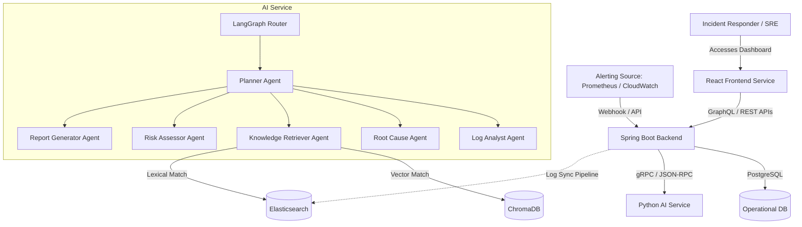

# Architecture Decision Record (ADR)

## ADR-0001: Autonomous Incident Response System (AIRS) Architecture Overview

* **Status**: Approved
* **Date**: 2026-06-17
* **Author**: Senior AI System Architect
* **Deciders**: Senior Engineering Team

---

## 📖 Context & Problem Statement

Modern enterprise platforms produce millions of alerts, system failures, and monitoring logs daily. Investigating these incidents, determining root cause, searching manual runbooks, and generating standardized reports takes critical operational time from senior engineers. We need a system that can:
1. Parse multi-source logs and aggregate alerts.
2. Coordinate multiple agents to analyze, query runbooks, and deduce root causes.
3. Automatically assemble incident reports.
4. Scale securely, handle enterprise data privately, and integrate into existing operations dashboards.

---

## 🏛️ Proposed Architecture

We propose a **three-tier microservices monorepo system** comprised of:
1. **Frontend UI Tier** (React + Tailwind CSS): A responsive operational dashboard.
2. **Backend Orchestration Tier** (Spring Boot): Handles relational data storage, security, alerts ingestion, and acts as the gatekeeper to the AI layer.
3. **AI Execution Tier** (Python + LangGraph + Vector Database): Executes multi-agent reasoning graphs, retrieves text chunks from knowledge bases, and performs RAG reasoning.

### System Diagram

---

## ⚡ Technical Decision Details

### 1. Language & Framework Choices
* **Python for AI Service**: Necessary to utilize the LangChain/LangGraph ecosystem, native Google Gemini APIs, and vector database drivers without incurring heavy bindings overhead.
* **Spring Boot for Backend**: Provides enterprise-grade security (Spring Security), high performance connection pooling (HikariCP), standard JPA/Hibernate data management, and reliable transaction boundaries for storing incidents metadata.
* **React + Tailwind for Frontend**: Enables rapid development of high-performance components, dynamic charts, and modular layout architectures with Tailwind configuration styling rules.

### 2. Multi-Agent Design (LangGraph)
We reject a standard linear chatbot or direct LLM completion system because incident investigation requires loops, tool executions, and conditional branches. LangGraph is selected because:
* It maintains a structured, cyclic graph topology.
* State is explicitly declared and passed between agents, avoiding memory leaks.
* It allows manual human-in-the-loop validation checkpoints before critical operations.

### 3. Dual Index Retrieval (RAG)
We combine:
* **ChromaDB**: For dense vector embeddings to match conceptual similarities (e.g. semantic meaning of an error message).
* **Elasticsearch**: For exact keyword matching (e.g. searching specific transaction IDs, hostnames, IP addresses, or CVEs).

---

## ⚖️ Consequences

### Positive
* **Decoupled Workloads**: High-compute LLM workloads are isolated in the AI Service. The backend remains fast and responsive.
* **Specialized Development**: Developers can work in parallel. The separation of concerns allows building the AI Graph, search indices, API layers, and UI views concurrently due to clear interface boundaries.
* **Resilient Infrastructure**: If the AI Service crashes or experiences high latency, the core incident dashboard and ingestion API remain fully operational.

### Negative / Trade-offs
* **Communication Latency**: Network hops between backend-service and ai-service. This will be mitigated by using compressed JSON over HTTP/2 or gRPC communication formats.
* **Deployment Complexity**: Multiple buildpacks and runtime environments require unified container management (Docker Compose for local development).
