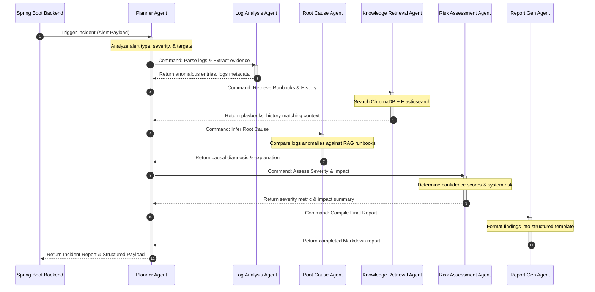

# Architecture Decision Record (ADR)

## ADR-0002: Agent Interaction and Flow Sequence

* **Status**: Approved
* **Date**: 2026-06-17
* **Author**: Senior AI System Architect

---

## 📖 Context & Problem Statement

We must design an execution sequence that ensures all 6 agent roles function cohesively without getting trapped in infinite loops, losing context, or ignoring critical evidence. A standard sequential pipeline (A -> B -> C) fails if the RAG search retrieves runbooks that suggest looking for distinct logs, or if the Risk Assessment determines that more investigation is required.

---

## 🧭 Proposed Agent Workflow & State Machine

We implement a centralized, state-based agent workflow using **LangGraph**. The entire execution revolves around a shared system state (`AirsState`) that holds alerts context, parsed evidence, search queries, risk details, and compiled report parts.

### Mermaid Interaction Flow



---

## 🔄 Shared State Architecture (`AirsState`)

The state schema passed between the agents will contain the following structural fields:

```python
class AirsState(TypedDict):
    incident_id: str                 # Unique UUID
    alert_details: dict              # Raw incoming alert payload
    log_anomalies: list[dict]        # Extracted indicators of compromise/errors
    runbooks_retrieved: list[dict]   # Referenced playbooks & guidelines
    historical_cases: list[dict]     # Historical cases matching this alert
    root_cause_diagnosis: str        # Formulated root cause analysis
    severity_assessment: dict        # Risk level, blast radius, confidence scores
    incident_report_md: str          # Final assembled Markdown report
    execution_errors: list[str]      # Stack trace logs or error records
    active_agent: str                # Current agent handling state
```

---

## 🛠️ Routing & Decision Decisions

1. **Centralized Router**: The **Planner Agent** acts as the dispatcher. Rather than agents calling each other directly, they always return to the graph controller, allowing the Planner Agent to evaluate conditional paths (e.g. if the Knowledge Retrieval Agent returns 0 results, the Planner may redirect to general troubleshooting procedures instead of specific runbooks).
2. **Deterministic specialist transitions**: To ensure stability and predictable latency, the standard execution follows a structured pipeline:
   `Alert -> Planner -> Log Analyst -> Knowledge Retriever -> Root Cause -> Risk Assessor -> Report Gen -> Exit`.
3. **Execution Safety Boundaries**: The graph will support a max loop limit of 10 nodes to prevent LLM execution cascades if agents fail to satisfy target schemas.
