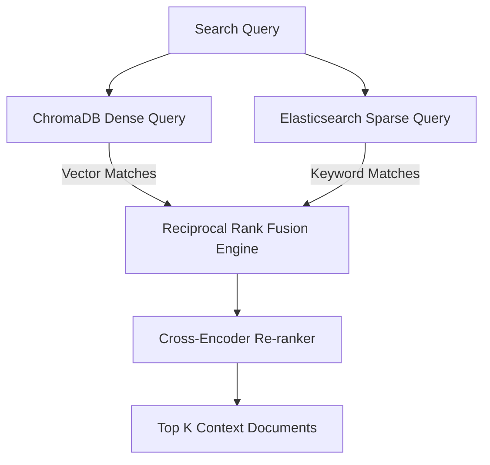

# Architecture Decision Record (ADR)

## ADR-0003: RAG Retrieval & Ingestion Strategy

* **Status**: Approved
* **Date**: 2026-06-17
* **Author**: Senior AI System Architect

---

## 📖 Context & Problem Statement

For an incident responder, retrieving the correct operational context is critical. If our RAG pipeline only uses dense vector similarity, it might fail to find documents mentioning specific error codes (like `NullPointerException` or `DB_TIMEOUT_403`), specific machine names, or CVE tags. Conversely, pure keyword search (Elasticsearch) fails to associate concepts like "database degradation" with "slow response latency."

---

## 🔍 Proposed Hybrid Search Strategy

We will implement a **Hybrid Search and Reciprocal Rank Fusion (RRF)** retrieval mechanism. The **Knowledge Retrieval Agent** will query both indices simultaneously and merge the ranks.

### 1. Vector Database (ChromaDB)
* **Embedding Model**: `text-embedding-004` (via Gemini API) or `all-MiniLM-L6-v2` (for local offline development).
* **Distance Metric**: Cosine Similarity.
* **Role**: Concepts, general procedures, contextual runbook matches.

### 2. Lexical Database (Elasticsearch)
* **Algorithm**: BM25.
* **Role**: Exact matching of server tags, error codes, CVE signatures, trace IDs, and network addresses.

---

## 📂 Document Ingestion & Chunking Plan

Documents will be processed differently based on their structure:

| Document Type | Source Directory | Chunking Strategy | Target Embeddings / Metadata |
| :--- | :--- | :--- | :--- |
| **Runbooks / Playbooks** | `datasets/knowledge_base/runbooks/` | Hierarchical Markdown chunking (headers-based, max 500 tokens). | Embed parent text. Metadata: `service_name`, `system_tier`, `author`. |
| **Historical Incidents** | `datasets/incident_reports/` | Key-value extraction (e.g. Symptoms, Mitigation, Resolution) as distinct sections. | Embed summary. Metadata: `incident_id`, `resolution_status`, `severity`. |
| **Operational Guides** | `datasets/knowledge_base/guides/` | Character-text splitting with overlap (300 chars). | General procedures. |
| **MITRE / NIST Specs** | `datasets/knowledge_base/reference/` | Section-level splitting based on threat IDs or compliance controls. | Metadata: `attack_id`, `nist_control_id`, `threat_category`. |

---

## ➕ Reciprocal Rank Fusion (RRF) Formula

When both indices return rank lists, document scores are merged using:

$$\text{RRF\_Score}(d \in D) = \sum_{m \in M} \frac{1}{k + r_m(d)}$$

Where:
* $M$ represents search models (ChromaDB and Elasticsearch).
* $r_m(d)$ is the rank of document $d$ within model $m$ (1-indexed).
* $k$ is a constant smoothing parameter (default = 60).

Top $N$ documents ($N \le 5$) with the highest score are selected to form the prompt context inject template.
